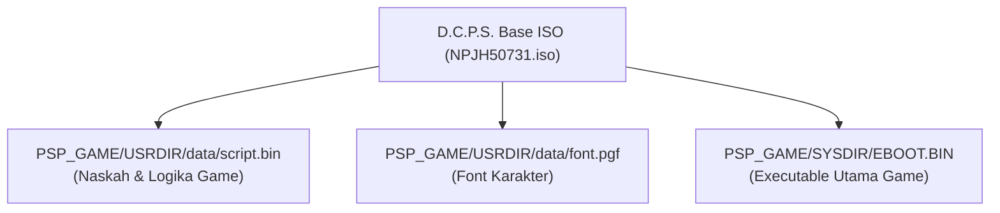

# Panduan Komprehensif Arsitektur & Reverse Engineering D.C.P.S. (PSP)
*Panduan Teknis, Pola Struktur Engine, dan Tutorial Terjemahan Multi-Bahasa (Indonesia/Inggris)*

---

## 1. Pendahuluan

Dokumen ini adalah **panduan belajar & referensi tunggal (Single Source of Truth)** untuk memahami struktur file, pola bytecode, format ISO, memori eksekutabel (EBOOT), dan alur kerja pembuatan terjemahan fan translation untuk game **D.C.P.S. (Da Capo 1 Plus Situation Portable)** pada platform Sony PlayStation Portable (PSP).

- **Game Title**: D.C.P.S. ～ダ・カーポ～ プラスシチュエーション ポータブル
- **Title ID**: `NPJH50731` / `ULJM05718`
- **Engine**: Circus Proprietary ADV Engine (PSP Port)
- **Karakter Utama (MC)**: 朝倉 純一 (*Asakura Jun'ichi*)
- **Target Platform**: PPSSPP Emulator & PSP Asli (Real Hardware)

---

## 2. Struktur Proyek (`F:\Games\PSP\dc1ps-psp-tools\`)

Struktur proyek telah didesain agar **reproducible (dapat dibangun ulang kapan saja)** meskipun folder `output/` (yang berisi file ISO ~1GB) dihapus untuk menghemat ruang hard disk.

```text
F:\Games\PSP\dc1ps-psp-tools\
├── build_iso.py               <-- Runner 1-klik untuk build ISO (EN / ID)
├── LEARN_THIS_PROJECT.md       <-- Panduan teknis arsitektur ini
├── PSP_TRANSLATION.md          <-- Status pipeline & catatan teknis
│
├── analysis/                  <-- Data hasil reverse engineering bytecode PSP
│   ├── dc1_script.json        <-- Dump publik 1.046 file skrip (Jepang)
│   ├── dc1_script.index.json  <-- Indeks struktural tipe, offset nama & teks
│   ├── scene_pairs.json       <-- Pemetaan 334 scene FanTL (PC <-> PSP)
│   ├── scene_pairs_mangagamer.json <-- Pemetaan 387 scene MangaGamer Official (PC <-> PSP)
│   └── line_align.json        <-- Pemetaan baris dialog antar scene
│
├── translations/              <-- SUMBER ASLI TERJEMAHAN (Multi-Bahasa)
│   ├── en/
│   │   ├── transfer_en.json   <-- Naskah lengkap EN (721 scene, 66.868 replacements)
│   │   └── transfer_en_fantl_only_backup.json <-- Backup aman naskah murni FanTL (334 scene)
│   └── id/
│       ├── transfer_id.json   <-- Naskah terjemahan Bahasa Indonesia
│       └── sheets/            <-- Sheet per-scene JSON yang mudah diedit penerjemah
│
├── tools/                     <-- Kumpulan script Python modular
│   ├── dc1_translate_tool.py  <-- Tool ekspor/impor naskah untuk penerjemah
│   ├── dc1_eboot_patch.py     <-- Patcher nama MC & 57 UI strings (EN & ID)
│   ├── dc1_import.py          <-- Rebuilder script.bin + jump re-anchoring
│   ├── dc1_iso.py             <-- Tool injeksi ISO (replace in-place & relocate)
│   ├── dc1_transfer.py        <-- Compiler naskah PC ke format transfer JSON
│   ├── line_align.py          <-- Aligner baris dialog Needleman-Wunsch
│   └── verify_rebuild.py      <-- Validator integritas bytecode & jump targets
│
├── work/                      <-- File kerja dan aset ekstraksi lokal
│   ├── extracted/
│   │   ├── EBOOT_CLEAN.ELF    <-- Executable ELF bersih hasil dekripsi PPSSPP
│   │   ├── script.bin         <-- Container skrip asli Jepang (4.386.172 byte)
│   │   ├── font.pgf           <-- Font asli 18px (1.325.928 byte)
│   │   └── font_small.pgf     <-- Font optimal skala 0.75 / 13.5px (1.043.588 byte)
│   ├── eboot_patched.elf      <-- ELF ter-patch hasil build
│   └── script_en.bin          <-- script.bin hasil build
│
└── output/                    <-- Folder output ISO final (bisa dihapus kapan saja)
    ├── D.C.P.S. [NPJH50731]_en.iso
    └── D.C.P.S. [NPJH50731]_id.iso
```

---

## 3. Anatomi File di Dalam ISO PSP

Di dalam file ISO D.C.P.S., terdapat 3 komponen utama yang harus dimodifikasi:



### 3.1. Format Container `script.bin` (DC1 Container)
`script.bin` bukanlah file teks biasa, melainkan container biner yang membungkus **1.046 file objek bytecode** (`script_0000.obj` s.d. `script_1045.obj`).

- **Header (16 byte)**:
  - `0x00 - 0x03`: Magic `DC1\x00`
  - `0x08 - 0x0B`: Ukuran total file dalam uint32 little-endian
  - `0x10`: Awal dari tabel offset (array uint32) yang mencatat alamat awal setiap file `.obj`.
- **Setiap File Objek (`OBJ`)**:
  - `0x00 - 0x03`: Magic `OBJ\x00`
  - `0x04 - 0x07`: Ukuran file OBJ tersebut (uint32 little-endian).
  - `0x08 - akhir`: Aliran instruksi bytecode (VM Instructions).

### 3.2. Bytecode Opcode Engine Circus
Setiap baris teks, nama, dan pilihan dikodekan dalam format token berikut:

| Opcode (Hex) | Deskripsi | Struktur Bytecode | Catatan |
| :--- | :--- | :--- | :--- |
| `43 01` | **Baris Teks / Dialog** | `[43 01] [u16 length] [text (Shift-JIS)] [\x0a]` | Diakhiri newline `\x0a` |
| `43 02` | **Clear Textbox** | `[43 02]` (2 byte tanpa payload) | Membersihkan kotak teks |
| `43 03` | **Nama Pembicara** | `[43 03] [u16 length] [name (Shift-JIS)]` | Tag nama di atas dialog |
| `46 01` | **Opsi Pilihan (Choices)** | `[46 01] [u16 length] [○choice text] [\x0a]` | Pilihan interaktif bercabang |
| `46 02` | **Jump Antar Pilihan** | `[46 02] [u16 jump_offset]` | Melompati opsi pilihan lain |
| `36 05` / `36 06` | **Navigasi / Peta** | `[op] [id_byte] [u16 length] [label]` | Pilihan lokasi / rute |
| `22 00/01/02/03/05`| **Relative Control Jump** | `[22 sub] ... [u16 relative_offset]` | Aliran eksekusi skrip VM |

#### ⚠️ Hukum Wajib Re-Anchoring Relative Jump:
Dalam bahasa Inggris maupun Indonesia, panjang kalimat hampir selalu **lebih panjang atau berbeda** dari bahasa Jepang aslinya. Akibatnya, posisi byte setiap instruksi di dalam file OBJ akan bergeser maju/mundur.
- Jika offset pada opcode jump (`46 02` dan `22 xx`) tidak dihitung ulang, pointer VM akan melompat ke tengah-tengah teks atau byte liar.
- **Dampak jika salah**: Emulator/PSP akan crash instan dengan error *"Bad Execution Address"* atau layar hitam diam.
- **Solusi**: Tool `tools/dc1_import.py` secara otomatis memindai seluruh 9.009 relative jump dan menghitung ulang targetnya secara presisi (*0 mismatches*).

---

## 4. Mekanisme Nama Protagonis & EBOOT

### 4.1. Masalah Nama di Versi Jepang
Di game aslinya:
- Nama default protagonis adalah **朝倉 純一** (*Asakura Jun'ichi*).
- Di dalam naskah skrip visual novel, engine menggunakan tag literal **`[name]`**. Saat game berjalan, engine membaca nama pemain dari memori save/engine lalu merender nama tersebut menggantikan placeholder `[name]`.
- Jika EBOOT tidak dipatch, saat pemain memulai game baru tanpa mengetik nama kanji via keyboard virtual PSP, nama default yang muncul adalah kanji Jepang `朝倉 純一`, dan tag `[name]` di narasi akan tampil sebagai `純一`.

### 4.2. Titik Patch EBOOT ELF
PPSSPP dengan opsi `DumpFileTypes = 255` mengekstrak ELF MIPS yang telah didekripsi (`work/extracted/EBOOT_CLEAN.ELF`, tepat 1.426.736 byte). Terdapat 4 offset tetap:
1. `0x099B70`: Given name default (`純一\0\0\0\0` $\rightarrow$ `Junichi\0`) [Slot 8 Byte]
2. `0x099B78`: Surname default (`朝倉\0\0\0\0` $\rightarrow$ `Asakura\0`) [Slot 8 Byte]
3. `0x09A2E0`: Init engine given name (`純一\0\0\0\0` $\rightarrow$ `Junichi\0`) [Slot 8 Byte]
4. `0x097CB4`: Teks tombol reset nama (`名前を『純一』に戻します。` $\rightarrow$ `Reset name to Junichi.` atau `Kembalikan ke Junichi.`) [Slot 28 Byte]

Karena panjang `"Junichi"` dan `"Asakura"` adalah 7 karakter + 1 null terminator = 8 byte, string ini **pas secara sempurna tanpa mengubah alamat pointer memori**.

### 4.3. Patch UI Menu & Batasan Firmware Save Utility
Tool `tools/dc1_eboot_patch.py` memetakan 57 string antarmuka ke memori EBOOT:
- Tombol konfirmasi *Yes/No* (*Ya/Tidak*).
- 20 Deskripsi menu konfigurasi sistem (*Volume Suara, BGM, Kecepatan Teks, Skip*, dll.).
- Layar galeri CG dan navigasi replay skenario.
- Dialog konfirmasi penyimpanan *Quick Save* dan peringatan data belum disimpan.

> [!CAUTION]
> **PANTANGAN FIRMWARE**: String metadata firmware PSP seperti `システムデータ` (*SYSTEM DATA*) dan `セーブデータ` (*SAVE DATA*) pada offset `0x099E40` dsb. **JANGAN PERNAH DIUBAH**.
> Fungsi firmware PSP `sceUtilitySavedataInitStart` mengecek panjang byte spesifik teks Shift-JIS asli. Mengubah string metadata ini akan menyebabkan game menutup diri secara tiba-tiba (*early exit*) saat membaca save data.

---

## 5. Optimalisasi Font (`font.pgf`)

- Font bawaan PSP di `PSP_GAME/USRDIR/data/font.pgf` berukuran asli **18 pixel** (didesain untuk kanji kotak Jepang).
- Huruf alfabet Latin (Inggris/Indonesia) memerlukan ruang horizontal lebih luas. Jika menggunakan font 18px asli, kalimat normal akan keluar (*overflow*) dari batas kotak dialog.
- Proyek ini menyertakan font teroptimasi [work/extracted/font_small.pgf](file:///F:/Games/PSP/dc1ps-psp-tools/work/extracted/font_small.pgf) berukuran **13.5 pixel (skala 0.75)**. Font ini menjaga teks tetap sangat tajam dan terbaca jelas, namun tidak meluber keluar kotak textbox (kapasitas ~60 karakter per baris).

---

## 6. Cara Menerjemahkan ke Bahasa Indonesia (Tutorial Step-by-Step)

Untuk membuat versi Bahasa Indonesia, ikuti langkah mudah berikut:

### Langkah 1: Siapkan Workspace Bahasa Indonesia
Buka terminal PowerShell di folder proyek `F:\Games\PSP\dc1ps-psp-tools`, lalu jalankan:
```powershell
python tools/dc1_translate_tool.py init-lang id
```
Perintah ini akan membuat folder `translations/id/` dan menyalin template dasar dari naskah English.

### Langkah 2: Ekspor Naskah ke Bentuk Sheet yang Mudah Dibaca
Jalankan perintah ekspor:
```powershell
python tools/dc1_translate_tool.py export-sheets id
```
Tool akan membuat 334 file JSON naskah di `translations/id/sheets/` (misalnya `script_0003.json`).

Bentuk isi filenya sangat ramah penerjemah:
```json
{
  "scene": "script_0003.obj",
  "dialogues": [
    {
      "offset": 258,
      "speaker": "Nemu",
      "jp": "「おはようございます、お兄ちゃん」",
      "text": "\"Good morning, onii-chan.\""
    }
  ],
  "choices": [
    {
      "offset": 4760,
      "jp": "○まぁ、起きたほうがいいな",
      "text": "○Sebaiknya aku bangun sekarang."
    },
    {
      "offset": 4795,
      "jp": "○後５分……",
      "text": "○5 menit lagi deh..."
    }
  ]
}
```
**Aturan Penerjemahan:**
1. Anda cukup mengedit isi field `"text"`. Teks asli Jepang (`jp`) dan referensi Inggris (`en`) dari FanTL/MangaGamer tetap tersedia sebagai panduan.
2. **Pilihan (Choices)**: Pastikan diawali tanda peluru `○` (`\u25cb`).
3. **Placeholder Nama**: Gunakan `[name]` jika ingin merujuk pada nama karakter utama yang bisa diatur pemain (misal: `"Hei, [name], cepat bangun!"`).
4. **Panjang Teks**: Disarankan maksimal ~55–60 karakter per baris agar pas di dalam kotak dialog. Gunakan `\n` untuk memisahkan baris kedua.
5. **Fallback Cerdas**: Jika suatu baris `"text"` belum Anda terjemahkan, sistem otomatis menggunakan teks bahasa Inggris (`en`) dari FanTL/MangaGamer, sehingga game tidak akan pernah crash dan tidak akan kembali ke huruf kanji Jepang mentah.

### Langkah 3: Impor Kembali Naskah yang Telah Diedit
Setelah selesai menerjemahkan sheet:
```powershell
python tools/dc1_translate_tool.py import-sheets id
```
Tool ini akan menyatukan seluruh sheet kembali ke dalam `translations/id/transfer_id.json`.

### Langkah 4: Kompilasi Menjadi ISO Final Bahasa Indonesia
Cukup jalankan runner satu perintah atau klik dua kali `build_indonesia.bat`:
```powershell
python build_iso.py --lang id
```

---

## 7. Analisis Lokasi UI & Aset Grafis Game

Untuk mengedit tampilan antarmuka (User Interface) game, aset terbagi menjadi dua kategori utama:

### 7.1. Teks UI (System Text & Menus)
* **Lokasi**: Di dalam file eksekutabel `PSP_GAME/SYSDIR/EBOOT.BIN` (Offset `0x0964D0` s/d `0x09A2E0`).
* **Konten**: 57 string penting termasuk pesan simpan/muat (*Quick Save/Load*), konfirmasi nama, pilihan konfigurasi layar & suara, serta menu dialog.
* **Cara Edit**: Sudah terotomatisasi di `tools/dc1_eboot_patch.py --lang id` atau `--lang en`.

### 7.2. Grafis & Tekstur UI (Gambar & Icon)
1. **Loose PNG (File Gambar Lepas)** di `PSP_GAME/USRDIR/data/`:
   * `sav_bg.png` (172 KB) : Background layar simpan/muat (*Save/Load Screen*).
   * `dc1_new.png` (5.3 KB) : Label grafis *"NEW"* pada slot save baru.
   * `sav_dc1.png` (4.9 KB) : Icon save data pada memory stick.
   * `sys_dc1.png` (5.4 KB) : Icon system data pada memory stick.
   * `PSP_GAME/ICON0.PNG` (4.9 KB) : Icon game saat dipilih di menu XMB PSP.
   * `PSP_GAME/PIC1.PNG` (144 KB) : Wallpaper latar belakang saat disorot di XMB PSP.
2. **Container Tekstur Game (`catfile.bin`)**:
   * **Lokasi**: `PSP_GAME/USRDIR/data/catfile.bin` (52,9 MB).
   * **Struktur**: Berisi **815 file tekstur format `MIG.00.1PSP`** yang dikompres dengan zlib. Menyimpan logo judul game (*Title Screen*), tombol menu utama (*Start, Load, Config*), bingkai kotak teks (*dialogue box*), dan ikon navigasi.
   * **Cara Ekstrak & Repack**:
     ```powershell
     # Ekstrak seluruh 815 tekstur ke folder custom/ui/catfile_extracted/
     python tools/dc1_assets.py extract-ui

     # Repack kembali setelah file .mig diedit
     python tools/dc1_assets.py repack-catfile
     ```
   * *Catatan Modding via PPSSPP*: Anda juga dapat menggunakan fitur **Texture Replacement** PPSSPP (`memstick/PSP/TEXTURES/NPJH50731/`) untuk mendump dan mengganti tekstur UI secara instan menggunakan format PNG standar tanpa harus mengedit biner `catfile.bin`!

---

## 8. Modifikasi Video (Opening & Ending dengan Subtitle/Lirik)

Video sinematik game menggunakan format **PMF (PlayStation Movie Format)**:
* **Opening Movie**: `PSP_GAME/USRDIR/data/dc1_op.pmf` (~37 MB).
* **Ending Movie**: `PSP_GAME/USRDIR/data/gend.pmf` (~7.7 MB).

### Cara Mengganti Video dengan Custom Opening (Misal Berisi Lirik):
1. **Ekstrak Video Asli**:
   ```powershell
   python tools/dc1_assets.py extract-video
   ```
   Video akan diekstrak ke folder: `custom/video/dc1_op.pmf`.
2. **Buat Video PMF Baru**:
   Gunakan tool converter video PSP standar (seperti *Sony UMD Stream Composer* atau *VirtualDub + PMF tools*) untuk membuat file `.pmf` baru dengan resolusi 480x272, codec H.264/AVC, dan audio ATRAC3plus / PCM.
3. **Injeksi Otomatis**:
   Cukup simpan file video baru Anda di `custom/video/dc1_op.pmf`. Saat Anda menjalankan `build_iso.py`, sistem akan secara otomatis merelokasi dan menanamkan video baru tersebut ke dalam ISO final, meskipun ukuran filenya lebih besar dari video aslinya!

---

## 9. Toolkit 1-Klik untuk Pengguna (`.bat` Scripts)

Di direktori utama telah disediakan file executable batch script agar modding dan kompilasi ISO sangat mudah dilakukan cukup dengan klik dua kali:

* **`run_menu.bat`**: Menu interaktif lengkap di terminal untuk build ISO (EN / ID), ekspor/impor naskah, ekstrak video, dan tes emulator PPSSPP.
* **`build_indonesia.bat`**: 1-klik untuk mengompilasi sheet Bahasa Indonesia dan menghasilkan ISO `output/D.C.P.S. [NPJH50731]_id.iso`.
* **`build_english.bat`**: 1-klik untuk membangun ulang ISO Bahasa Inggris `output/D.C.P.S. [NPJH50731]_en.iso`.

---

## 10. Cara Membangun Ulang ISO Bahasa Inggris (Quick Rebuild)

Jika suatu saat Anda menghapus folder `output/` untuk menghemat ruang disk, Anda dapat membuat kembali ISO Bahasa Inggris kapan saja hanya dengan perintah:
```powershell
python build_iso.py --lang en
```
ISO final akan langsung ter-generate di `output/D.C.P.S. [NPJH50731]_en.iso` dan siap langsung dimainkan di PPSSPP!

### 7.1. Integrasi MangaGamer Official English (Hybrid Architecture)
Patch bahasa Inggris kini menggunakan arsitektur hybrid non-destruktif:
1. **FanTL Locked (334 scene)**: Seluruh terjemahan FanTL PC untuk Common route, Kotori, Tamaki, Alice, Kanae, dan choices tetap 100% terkunci dan tidak tersentuh.
2. **MangaGamer Backfill (387 scene)**: Seluruh route yang sebelumnya masih RAW Jepang (Nemu Asakura, Sakura Yoshino, Miharu Amakase, Mako & Moe Mizukoshi, Misaki Sawai, Yoriko Sagisawa) diambil dari naskah resmi MangaGamer PC melalui `tools/dc1_mangagamer_transfer.py`.
3. **Total Coverage**: **721 scene** dan **66.868 token teks** terjemahan aktif!

---

## 8. Tabel Ringkasan Hash Verifikasi (Baseline)

| Komponen | Ukuran (Byte) | MD5 Checksum | Status |
| :--- | :--- | :--- | :--- |
| **`EBOOT_CLEAN.ELF`** | 1.426.736 | `c4fc1a9f506de5097fcdc372dafb88a8` | Master Clean Dump |
| **`font_small.pgf`** | 1.043.588 | `cb2c3a33f6e48f741fe8b88361276d8c` | Scaled 0.75 Font |
| **`script.bin` (Clean JP)** | 4.386.172 | `70fa67f6772da37c87cff17fa6b78d91` | Original Extracted |
| **`eboot_en.elf`** | 1.426.736 | `8e933fda07c301434d0a1ff0abb094d9` | Patched EN EBOOT |
| **`script_en.bin`** | 4.622.320 | `e59a4ff1f7375276ea993f41ff77f8d6` | Patched EN Script (721 scenes) |
| **`D.C.P.S. [NPJH50731]_en.iso`** | 1.000.376.320 | `87e11e0c3cdfc4c145d22ee31c5c0bb5` | Final Rebuilt ISO (Hybrid FanTL+MangaGamer) |
