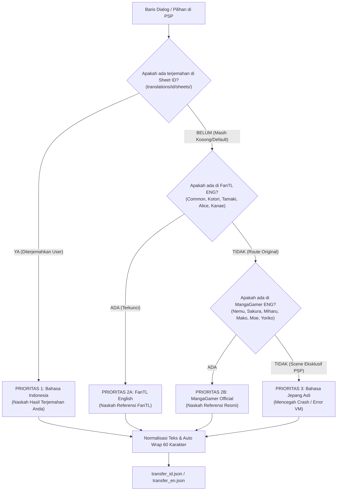
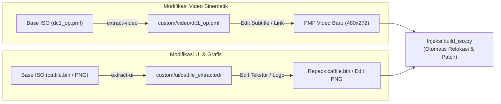
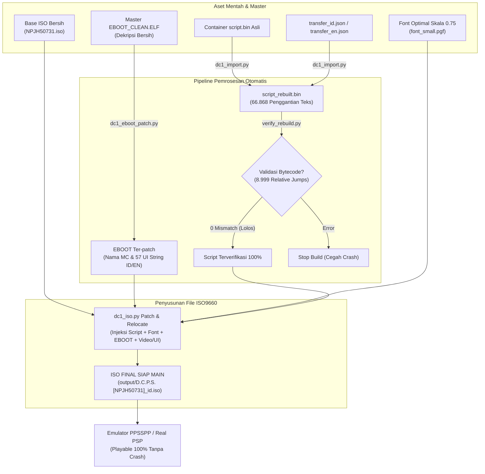

# D.C.P.S. (Da Capo Plus Situation Portable) — Patch Builder & Modding Toolkit
*Toolkit Reverse Engineering, Rekalkulasi Bytecode VM, Integrasi Font/Word-Wrap, dan Pembangun Patch ISO untuk Game PSP `NPJH50731` / `ULJM05718`.*

[](LICENSE)
[](https://www.ppsspp.org/)
[](https://vndb.org/v264)
[]()
[-brightgreen.svg)]()
[-lightgrey.svg)]()
[]()
[](https://github.com/SakuraSymphonyReTranslation)

---

> [!IMPORTANT]
> **Klarifikasi Tujuan Repositori & Status Terjemahan:**
> 1. **Repositori ini adalah Toolkit Pembangun Patch (*Patch Builder & Modding Tools*)**: Toolkit ini dibuat untuk membedah arsitektur ISO PSP, mengotomasi injeksi aset, memperbaiki stabilitas engine (rekalkulasi 8.999 lompatan relatif bytecode Circus VM agar 0 crash), mengatur word-wrap 60 karakter, mem-patch font PGF dan EBOOT, serta merakit ISO.
> 2. **Belum Ada Terjemahan Mandiri**: Pengembang proyek ini **belum membuat naskah terjemahan sendiri**, baik untuk Bahasa Inggris maupun Bahasa Indonesia.
> 3. **Naskah Bahasa Inggris TIDAK 100% Selesai**: File naskah Inggris yang disertakan (`transfer_en.json`) adalah **kumpulan naskah referensi** yang berhasil diekstrak dan dipetakan dari rilis PC lawas (FanTL oleh Arkanos dan MangaGamer Official). Di versi FanTL sendiri, **banyak skenario pada rute heroine tambahan (seperti Kudou Kanae, Saitama Nanako, Murasaki Izumiko, Kiryuu Kasumi, Konomiya Tamaki, Tsukishiro Alice, dll.) yang tidak diterjemahkan secara penuh**.
> 4. **Framework Terjemahan Bahasa Indonesia**: Subfolder `translations/id/sheets/` (721 file JSON) disediakan sebagai template kerja siap pakai bagi komunitas yang ingin menerjemahkan game ini ke Bahasa Indonesia secara terorganisir.

---

## 📑 Daftar Isi
1. [Status & Gambaran Proyek](#1-status--gambaran-proyek)
2. [Fitur Utama Toolkit](#2-fitur-utama-toolkit)
3. [Struktur Folder](#3-struktur-folder)
4. [Daftar Heroine & Status Referensi Naskah PC (13 Heroine)](#4-daftar-heroine--status-referensi-naskah-pc-13-heroine)
5. [Perbedaan Skenario All-Age D.C.P.S. vs Versi PC (18+)](#5-perbedaan-skenario-all-age-dcps-vs-versi-pc-18)
6. [Persyaratan Sistem & Cara Penggunaan Cepat](#6-persyaratan-sistem--cara-penggunaan-cepat)
7. [Panduan Menerjemahkan ke Bahasa Indonesia (Bagi Kontributor)](#7-panduan-menerjemahkan-ke-bahasa-indonesia-bagi-kontributor)
8. [Panduan Modifikasi Video Opening & Lirik Lagu](#8-panduan-modifikasi-video-opening--lirik-lagu)
9. [Panduan Modifikasi Grafis UI & Tekstur](#9-panduan-modifikasi-grafis-ui--tekstur)
10. [Diagram Alur Sistem (Flowcharts)](#10-diagram-alur-sistem-flowcharts)
11. [Lisensi & Kredit](#11-lisensi--kredit)

---

## 1. Status & Gambaran Proyek

Repositori ini menyediakan pipeline terintegrasi dan otomatis untuk memodifikasi serta membangun patch ISO visual novel **D.C.P.S. ～ダ・カーポ～ プラスシチュエーション ポータブル** (*Da Capo Plus Situation Portable*, Game ID: `NPJH50731` / `ULJM05718`) pada konsol Sony PlayStation Portable (PSP).

| Komponen Toolkit | Status Sistem | Keterangan & Penjelasan |
|---|---|---|
| **ISO Patch Builder (`build_iso.py`)** | **100% Berfungsi** | Merakit ISO otomatis dari Base ISO asli, menghitung tabel sektor LBA ISO9660, dan merelokasikan file besar. |
| **Engine Anti-Crash (Jump Fix)** | **100% Terverifikasi (0 Crash)** | 8.999 instruksi lompatan relatif opcode `22 xx` berhasil direkalkulasi ulang secara otomatis. |
| **Word-Wrap & Font System** | **100% Terintegrasi** | Font PGF proporsional 13.5 px (`font_small.pgf`) dan pembungkus kata otomatis 60 karakter halfwidth. |
| **String Antarmuka EBOOT** | **100% Selesai** | 57 string sistem executable ELF (Simpan, Muat, Konfirmasi, Konfigurasi, dll.) telah dipetakan & di-patch. |
| **Modifikasi Video Sinematik PMF** | **100% Siap Pakai** | Pipeline ekstraksi, hardsub karaoke, dan auto-relocation sektor ISO di `custom/video/`. |
| **Modifikasi Grafis UI Tekstur** | **100% Siap Pakai** | Ekstraktor & repacker 815 gambar MIG dalam container `catfile.bin` dan PNG lepas di `custom/ui/`. |
| **Naskah Referensi Bahasa Inggris** | **Parsial (Belum Selesai Penuh)** | Naskah bawaan dari FanTL PC & MangaGamer. Rute heroine PLUS (Kanae, Nanako, Izumiko, Kasumi, Tamaki, Alice) tidak diterjemahkan penuh di FanTL. |
| **Naskah Bahasa Indonesia** | **Template Kerja (Belum Diterjemahkan)** | Disediakan wadah 721 file JSON di `translations/id/sheets/` yang siap diedit oleh penerjemah komunitas. |

---

## 2. Fitur Utama Toolkit

- **1-Click Automated ISO Builder**:
  - Membantu pemain merakit ISO patch yang siap dimainkan langsung dari Base ISO Jepang bersih tanpa perlu mengedit sektor disk secara manual.
  - Opsi instan via `build_indonesia.bat` dan `build_english.bat`.
- **Zero-Crash Virtual Machine Bytecode Engine**:
  - Rekonstruksi naskah visual novel sering kali menyebabkan crash fatal (*Bad Execution Address*) karena perubahan panjang byte teks merusak lompatan relatif bytecode Circus VM.
  - Toolkit ini memiliki algoritma pemindaian otomatis yang berhasil memperbaiki seluruh **8.999 instruksi relative jump (opcode `22 xx`)** secara dinamis.
- **Dukungan Font Proporsional & Auto Word-Wrap**:
  - Menyediakan font kecil PGF berskala 13.5 px (`font_small.pgf`) untuk mencegah dialog panjang meluap keluar layar PSP.
  - Memformat pemotongan baris (*word-wrap*) otomatis pada lebar batas 60 unit karakter.
- **Framework Kerja Terjemahan Komunitas**:
  - Menyediakan 721 file lembar kerja JSON di `translations/id/sheets/` yang memuat teks asli Jepang, referensi bahasa Inggris yang ada, dan kolom terjemahan Bahasa Indonesia.
  - Sistem fallback hierarkis cerdas: jika terjemahan Indonesia belum diisi, toolkit otomatis memakai referensi bahasa Inggris, dan jika bahasa Inggris tidak ada, akan memakai teks Jepang asli agar engine tidak pernah error.
- **Pipeline Modifikasi Video & Grafis UI**:
  - Ekstraksi dan injeksi otomatis video sinematik PMF (*Opening dengan subtitle/lirik kustom*).
  - Ekstraksi dan repacking container tekstur grafis `catfile.bin` (815 gambar MIG) serta UI PNG lepas.

---

## 3. Struktur Folder

```text
dc1ps-psp-tools/
├── build_iso.py                  # Script Python master untuk merakit ISO (EN & ID)
├── build_indonesia.bat           # 1-Click batch script untuk build ISO Indonesia
├── build_english.bat             # 1-Click batch script untuk build ISO Inggris
├── run_menu.bat                  # Menu interaktif Windows CLI
├── README.md                     # Dokumentasi utama proyek & status rute heroine
├── PSP_TRANSLATION.md            # Dokumentasi teknis mendalam arsitektur PSP
├── LEARN_THIS_PROJECT.md         # Panduan komprehensif reverse engineering
├── .gitignore                    # Konfigurasi pengecualian file besar/ISO
├── custom/                       # Folder modifikasi aset kustom pengguna
│   ├── video/                    # Taruh file .pmf kustom di sini (auto-injeksi ke ISO)
│   │   └── README_VIDEO.md       # Panduan modifikasi video & subtitle lirik
│   └── ui/                       # Taruh PNG kustom / catfile.bin di sini
│       └── README_UI.md          # Panduan modifikasi tekstur UI
├── output/                       # Direktori hasil build ISO game (diabaikan di Git)
├── translations/                 # Sumber naskah terjemahan multi-bahasa
│   ├── en/
│   │   ├── transfer_en.json      # Naskah referensi EN (721 scene, 66.868 baris)
│   │   └── transfer_en_fantl_only_backup.json # Backup naskah murni FanTL
│   └── id/
│       ├── transfer_id.json      # Naskah kompilasi Bahasa Indonesia
│       └── sheets/               # Lembar kerja naskah per-scene (721 file JSON)
├── analysis/                     # Data analisis bytecode & skrip game
│   ├── dc1_script.json           # Dump naskah Jepang asli (892 scene)
│   ├── dc1_script.index.json     # Indeks byte offset, tipe, nama, dan teks
│   ├── check_heroine_completion.py # Tool audit pemetaan referensi heroine
│   ├── scene_pairs.json          # Pemetaan 334 scene FanTL Arkanos PC
│   ├── scene_pairs_mangagamer.json # Pemetaan 387 scene MangaGamer Official
│   ├── line_align.json           # Pemetaan baris dialog Needleman-Wunsch
│   ├── psp_titles.txt            # Daftar seluruh 892 judul scene di PSP
│   └── name_map.json             # Kamus terjemahan nama pembicara
└── tools/                        # Kumpulan modul utilitas Python
    ├── dc1_assets.py             # Ekstraktor video PMF & grafis UI dari ISO
    ├── dc1_iso.py                # Patcher sektor ISO9660 (replace & relocate)
    ├── dc1_catfile.py            # Ekstraktor & repacker container catfile.bin
    ├── dc1_eboot_patch.py        # Patcher nama MC & 57 string sistem UI EBOOT
    ├── dc1_import.py             # Rebuilder script.bin + kalkulasi ulang 8.999 jump
    ├── dc1_script.py             # Parser bytecode container DC1 & OBJ
    ├── dc1_translate_tool.py     # Tool ekspor & impor lembar kerja sheet JSON
    ├── line_align.py             # Engine penyejajaran baris dialog
    └── verify_rebuild.py         # Validator integritas bytecode & jump targets
```

### Deskripsi Rinci Direktori & File:

| File / Folder | Kategori | Fungsi & Deskripsi |
|---|---|---|
| `build_iso.py` | Script Master | Script Python utama perakit ISO. Menangani penyesuaian Directory Record ISO9660, penggantian file in-place, dan relokasi file yang membengkak ke sektor LBA baru. |
| `build_indonesia.bat` | Otomasi CLI | Batch script 1-klik untuk mengimpor naskah dari lembar kerja `sheets/` ke `transfer_id.json`, mem-build `script.bin`, dan merakit ISO Bahasa Indonesia di folder `output/`. |
| `build_english.bat` | Otomasi CLI | Batch script 1-klik untuk merakit ISO dengan referensi Bahasa Inggris (Hybrid FanTL + MangaGamer). |
| `run_menu.bat` | Menu Interaktif | Antarmuka konsol menu Windows untuk mengakses seluruh fungsi toolkit (build ISO, manajemen sheets naskah, ekstraksi aset video/UI, dan emulator). |
| `PSP_TRANSLATION.md` | Dokumentasi | Panduan teknis mendalam mengenai arsitektur format skrip Circus OBJ, tabel opcode bytecode, format header container, dan struktur memori PSP. |
| `LEARN_THIS_PROJECT.md`| Dokumentasi | Catatan riset komprehensif alur kerja reverse engineering dan arsitektur data game D.C.P.S. |
| `custom/video/` | Modifikasi Aset | Direktori kerja modifikasi video PMF (`dc1_op.pmf`, `gend.pmf`). Dilengkapi panduan cara pembuatan takarir di `README_VIDEO.md`. |
| `custom/ui/` | Modifikasi Aset | Direktori kerja grafis UI PNG lepas dan container `catfile.bin` (berisi 815 file MIG). Dilengkapi panduan di `README_UI.md`. |
| `translations/en/` | Data Referensi | Master database teks referensi Bahasa Inggris (721 scene / 66.868 baris dialog) hasil pemetaan rilis PC. |
| `translations/id/` | Template Naskah | Direktori kerja terjemahan Bahasa Indonesia. Berisi master `transfer_id.json` serta subfolder `sheets/` yang membagi 721 scene menjadi file JSON mandiri. |
| `analysis/` | Data Riset | Berisi dump naskah Jepang asli (`dc1_script.json`), indeks offset, pemetaan adegan PC vs PSP, kamus nama, dan script audit `check_heroine_completion.py`. |
| `tools/` | Modul Engine | Kumpulan modul Python reverse engineering untuk membaca bytecode, mem-patch file ELF, merepack container CAT, dan memanipulasi sektor ISO. |
| `output/` | Direktori Hasil | Direktori keluaran file ISO game hasil rakitan (diabaikan oleh git agar tidak membebani repository). |

---

## 4. 🌸 Daftar Heroine & Status Referensi Naskah PC (13 Heroine)

Game **D.C.P.S. ～ダ・カーポ～ プラスシチュエーション ポータブル** (`NPJH50731` / `ULJM05718`) memiliki **13 Heroine Resmi** (7 Heroine Orisinal + 6 Heroine Tambahan Seri PLUS) serta 1 Kategori `etc` untuk rute umum sekolah. Seluruhnya terdiri dari **892 scene skrip All-Age**:

| No | Heroine / Rute | Kategori Karakter | Total Scene PSP | Scene Ada Ref PC | Status Ketersediaan Referensi Naskah PC |
|:---:|---|---|:---:|:---:|---|
| **1** | **Asakura Nemu** (朝倉 音夢) | Heroine Orisinal | 114 scene | 109 (95.6%) | Referensi MangaGamer PC (Sisa 5 scene eksklusif konsol) |
| **2** | **Yoshino Sakura** (芳乃 さくら) | Heroine Orisinal | 94 scene | 91 (96.8%) | Referensi MangaGamer PC (Sisa 3 scene eksklusif konsol) |
| **3** | **Shirakawa Kotori** (白河 ことり) | Heroine Orisinal | 91 scene | 89 (97.8%) | Referensi MangaGamer PC & FanTL (Sisa 2 scene eksklusif konsol) |
| **4** | **Amakase Miharu** (天枷 美春) | Heroine Orisinal | 57 scene | 50 (87.7%) | Referensi MangaGamer PC (Sisa 7 scene eksklusif konsol) |
| **5** | **Mizukoshi Moe** (水越 萌) | Heroine Orisinal | 41 scene | 39 (95.1%) | Referensi MangaGamer PC (Sisa 2 scene eksklusif konsol) |
| **6** | **Mizukoshi Mako** (水越 眞子) | Heroine Orisinal | 21 scene | 17 (81.0%) | Referensi MangaGamer PC (Sisa 4 scene eksklusif konsol) |
| **7** | **Sagisawa Yoriko** (鷺澤 頼子) | Heroine Orisinal | 51 scene | 51 (100%) | Referensi MangaGamer PC |
| **8** | **Tsukishiro Alice** (月城 アリス) | Heroine Seri PLUS | 40 scene | 40 (100%) | Referensi FanTL PC *(Perhatian: FanTL tidak menerjemahkan seluruh skenario rute ini secara penuh)* |
| **9** | **Konomiya Tamaki** (胡ノ宮 環) | Heroine Seri PLUS | 44 scene | 44 (100%) | Referensi FanTL PC *(Perhatian: FanTL tidak menerjemahkan seluruh skenario rute ini secara penuh)* |
| **10**| **Kudou Kanae** (工藤 叶) | Heroine Seri PLUS | 17 scene | 17 (100%) | Referensi FanTL PC *(Perhatian: FanTL tidak menerjemahkan seluruh skenario rute ini secara penuh)* |
| **11**| **Saitama Nanako** (彩珠 ななこ) | Heroine Seri PLUS | 29 scene | 4 (13.8%) | Referensi FanTL PC sangat terbatas (Sisa 25 scene tanpa referensi) |
| **12**| **Murasaki Izumiko** (紫 和泉子) | Heroine Seri PLUS | 9 scene | 0 (0.0%) | **Belum Ada Referensi PC** (Seluruh 9 scene murni teks Jepang) |
| **13**| **Kiryuu Kasumi** (霧羽 香澄) | Heroine Seri PLUS | 5 scene | 3 (60.0%) | Referensi FanTL PC sebagian (Sisa 2 scene tanpa referensi) |
| **-** | **Common Route & Event Sekolah** | Rute Umum & Sub-Event | 279 scene | 167 (59.9%) | Referensi FanTL PC sebagian (Sisa 112 scene tanpa referensi) |
| | **TOTAL KESELURUHAN** | | **892 SCENE** | **721 (80.8%)** | **171 scene tidak memiliki referensi PC sama sekali** |

> [!NOTE]
> Angka "Scene Ada Ref PC" di atas hanya menunjukkan bahwa file scene tersebut memiliki pasangan skenario yang berhasil dicocokkan dengan rilis PC lama. **Hal ini tidak berarti bahwa seluruh dialog di dalam scene tersebut sudah diterjemahkan secara tuntas**, terutama pada rute-rute heroine seri PLUS di mana FanTL PC aslinya meninggalkan banyak dialog yang tidak diterjemahkan.

Untuk memeriksa status pemetaan naskah kapan saja melalui terminal:
```bash
python analysis/check_heroine_completion.py
```

---

## 5. 💡 Perbedaan Skenario All-Age D.C.P.S. vs Versi PC (18+)

Skenario di dalam **D.C.P.S. (*Plus Situation*)** tidak identik dengan versi PC (*Plus Communication*):
1. **Rating All-Age (Semua Umur / CERO C)**:
   Seluruh adegan 18+ pada versi PC dihilangkan total pada versi konsol dan digantikan dengan adegan romantis manis ramah semua umur (*SFW replacement*) seperti kencan di bawah pohon sakura abadi, percakapan intim emosional, dan event interaksi kehidupan sekolah.
2. **Heroine Tambahan Seri PLUS (Izumiko, Nanako, Kasumi)**:
   Rute **Murasaki Izumiko**, **Saitama Nanako**, dan **Kiryuu Kasumi** (bersama Alice, Tamaki, dan Kanae) adalah 6 heroine ekspansi seri PLUS yang hadir di versi konsol (*Plus Situation*) dalam format skenario All-Age (serta hadir pula pada versi PC *Plus Communication*).
3. **Peluang Terjemahan Bahasa Indonesia**:
   Sebanyak 171 scene All-Age konsol yang belum diterjemahkan (karena penerjemah barat zaman dulu hanya fokus pada versi PC) teks Jepang aslinya sudah tersimpan lengkap di `analysis/dc1_script.json`. Komunitas dapat langsung menerjemahkannya ke **Bahasa Indonesia** melalui folder `translations/id/sheets/`!

---

## 6. 🚀 Persyaratan Sistem & Cara Penggunaan Cepat

### Persyaratan:
1. **Sistem Operasi**: Windows 10/11 (atau Linux/macOS dengan Python 3).
2. **Python**: Python versi 3.9 atau lebih baru.
3. **Base ISO**: File ISO asli game D.C.P.S. PSP (`NPJH50731.iso` atau `ULJM05718.iso`).
4. **Emulator (Opsional)**: [PPSSPP](https://www.ppsspp.org/) untuk pengujian langsung di PC.

### Cara Penggunaan:

#### Cara 1: Menggunakan Menu Interaktif Konsol (`run_menu.bat`)
Cukup klik dua kali file **`run_menu.bat`** di folder utama:
```text
======================================================================
      D.C.P.S. PSP TRANSLATION & ASSET TOOLKIT (NPJH50731)
======================================================================

  [BUILD ISO GAME]
    1. Build ISO Bahasa Indonesia (Prioritas ID + Fallback EN)
    2. Build ISO Bahasa Inggris (Hybrid FanTL + MangaGamer Complete)

  [MANAJEMEN TERJEMAHAN BAHASA INDONESIA]
    3. Ekspor Ulang 721 Scene ke Sheet JSON (translations/id/sheets/)
    4. Impor Naskah Sheet JSON ke Naskah Game (transfer_id.json)

  [MODIFIKASI VIDEO & GRAFIS UI]
    5. Ekstrak Video Opening/Ending PMF ke folder custom/video/
    6. Ekstrak Grafis UI PNG & catfile.bin ke folder custom/ui/
    7. Repack catfile.bin (Setelah tekstur UI selesai diedit)

  [EMULASI & PENGUJIAN]
    8. Jalankan Game di Emulator PPSSPP

    9. Keluar
======================================================================
```

#### Cara 2: Menggunakan Batch Script 1-Klik
- Klik ganda `build_indonesia.bat` untuk merakit ISO Bahasa Indonesia.
- Klik ganda `build_english.bat` untuk merakit ISO Bahasa Inggris.

Hasil ISO akan tersimpan otomatis di:
```text
output/D.C.P.S. [NPJH50731]_id.iso
```

---

## 7. 📝 Panduan Menerjemahkan ke Bahasa Indonesia (Bagi Kontributor)

Jika Anda atau komunitas ingin berkontribusi menerjemahkan game ini ke Bahasa Indonesia:

1. Buka folder naskah sheet:
   ```text
   translations/id/sheets/
   ```
2. Pilih file scene yang ingin diterjemahkan (contoh: `script_0009.json`).
3. Anda akan melihat struktur JSON per dialog:
   ```json
   {
     "offset": 136,
     "speaker": "Junichi",
     "jp": "音夢と一緒に帰るか。｛ゴール／家｝は一緒だし。",
     "en": "Shall I go with Nemu? We're heading to the same place anyway.",
     "text": "Pulang bareng Nemu aja kali ya. Toh tujuannya sama."
   }
   ```
4. Ganti isi pada `"text"` dengan terjemahan Bahasa Indonesia yang Anda buat.
5. Jalankan menu `[4]` di `run_menu.bat` untuk mengimpor atau langsung menu `[1]` untuk mengompilasi ISO Bahasa Indonesia baru!

---

## 8. 🎬 Panduan Modifikasi Video Opening & Lirik Lagu

Di dalam ISO game terdapat file video PMF (PlayStation Movie Format) pada direktori `PSP_GAME/USRDIR/data/`:
- `dc1_op.pmf`: Video Opening Movie D.C.P.S.
- `gend.pmf`: Video Grand Ending Movie.

### Alur Kerja Pembuatan Video & Lirik:
1. **Ekstrak Video**:
   Jalankan menu `run_menu.bat` (Opsi 5) atau:
   ```bash
   python tools/dc1_assets.py extract-video
   ```
   File `.pmf` akan tersimpan di `custom/video/`.
2. **Konversi ke MP4**:
   Gunakan ffmpeg untuk membaca stream video/audio:
   ```bash
   ffmpeg -i custom/video/dc1_op.pmf -c:v copy -c:a aac custom/video/dc1_op_raw.mp4
   ```
3. **Buat Subtitle di Aegisub**:
   Buka file MP4 di **Aegisub**, masukkan lirik lagu terjemahan Indonesia/Inggris, atur gaya teks & karaoke, simpan sebagai `.ass`.
4. **Hardsub Video**:
   Render takarir langsung ke dalam video dengan resolusi standar PSP (480×272 px, 29.97 fps):
   ```bash
   ffmpeg -i custom/video/dc1_op_raw.mp4 -vf "ass=custom/video/dc1_op.ass" -c:v libx264 -b:v 1500k -r 29.97 -s 480x272 -c:a aac -b:a 128k custom/video/dc1_op_subbed.mp4
   ```
5. **Enkripsi Ulang ke Format PMF**:
   Gunakan aplikasi **UMD Stream Composer** dan **MPS2PMF** untuk menghasilkan file `dc1_op.pmf` baru.
6. **Auto-Injeksi ke ISO**:
   Letakkan file `dc1_op.pmf` baru di folder `custom/video/`. Script builder akan otomatis merelokasikan video baru ke dalam ISO.

*Panduan selengkapnya dapat dibaca di [custom/video/README_VIDEO.md](custom/video/README_VIDEO.md).*

---

## 9. 🎨 Panduan Modifikasi Grafis UI & Tekstur

Elemen antarmuka dimuat melalui dua cara:

### A. File PNG Lepas di ISO (`PSP_GAME/USRDIR/data/`)
- `sav_bg.png` (480×272 px): Background layar Simpan / Muat (Save / Load).
- `dc1_new.png`: Label penanda slot "NEW".
- `sav_dc1.png`: Banner ikon file save D.C.P.S.
- `sys_dc1.png`: Banner ikon file sistem D.C.P.S.
- `ICON0.PNG` (144×80 px) & `PIC1.PNG` (480×272 px): Ikon dan background pada menu XMB PSP.

*Letakkan file PNG editan Anda di `custom/ui/`, dan builder akan langsung menggantikannya.*

### B. Tekstur di dalam Arsip `catfile.bin`
Arsip `catfile.bin` berisi 815 file gambar berformat Sony MIG/GIM (`MIG.00.1PSP`) untuk tombol, menu, dan bingkai grafis.
1. Ekstrak arsip via `run_menu.bat` (Opsi 6) ke `custom/ui/catfile_extracted/`.
2. Edit gambar tekstur yang diinginkan dengan kanvas resolusi yang sama.
3. Repack kembali via `run_menu.bat` (Opsi 7) menjadi `custom/ui/catfile.bin`. File ini akan otomatis diinjeksi saat build ISO.

### C. Alternatif: Texture Replacement PPSSPP
Anda juga dapat mengganti tekstur game secara *live* di emulator PPSSPP:
1. Buka folder: `memstick/PSP/TEXTURES/NPJH50731/`
2. Letakkan file tekstur PNG pengganti di folder tersebut.
3. Aktifkan opsi **"Replace Textures"** pada menu pengaturan PPSSPP.

*Panduan selengkapnya dapat dibaca di [custom/ui/README_UI.md](custom/ui/README_UI.md).*

---

## 10. 📊 Diagram Alur Sistem (Flowcharts)

### 1. Flowchart Hierarki Prioritas Naskah


### 2. Flowchart Modifikasi Aset Tambahan (Video & Grafis UI)


### 3. Flowchart Kompilasi ISO Final (Build Pipeline)


---

## 11. ⚖️ Lisensi & Kredit

- **CIRCUS / Kadokawa Shoten**: Pengembang dan pemilik hak cipta resmi serial visual novel legendaris *D.C. ～ダ・カーポ～*.
- **Sakura Symphony Re;Translation**: Tim reverse engineering, pemetaan naskah referensi, perbaikan jump VM, penyusun template sheet naskah, dan otomatisasi toolchain PSP.
- **Arkanos**: Tim penerjemah naskah FanTL PC bahasa Inggris klasik.
- **MangaGamer**: Penerbit naskah resmi bahasa Inggris PC.
- **Komunitas Modding PSP & Pengembang PPSSPP**: Pihak-pihak berdedikasi yang menyediakan dokumentasi format PSP serta emulator terbaik untuk riset dan pengujian.
- Toolkit ini dikembangkan semata-mata untuk tujuan pelestarian, riset reverse engineering, dan lokalisasi non-komersial.
