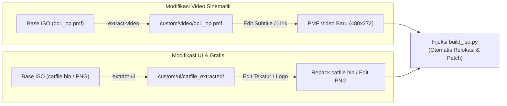
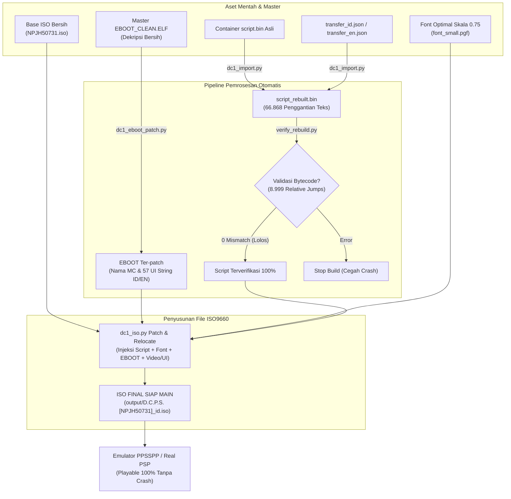

# D.C.P.S. (Da Capo 1 Plus Situation Portable) - Translation & Modding Toolkit
*Toolkit Lengkap Reverse Engineering, Penerjemahan Multi-Bahasa (English & Bahasa Indonesia), dan Modifikasi Aset untuk Game PSP `NPJH50731` / `ULJM05718`.*

[](LICENSE)
[](https://www.ppsspp.org/)
[]()

---

## 📖 Tentang Proyek

Repositori ini menyediakan pipeline terintegrasi dan otomatis untuk menerjemahkan serta memodifikasi visual novel legendaris **D.C.P.S. ～ダ・カーポ～ プラスシチュエーション ポータブル** pada konsol PlayStation Portable (PSP).

### ✨ Fitur Utama:
1. **Arsitektur Hybrid Lengkap (721 Scene / 66.868 Baris Teks)**:
   - **FanTL English**: Mengunci terjemahan PC FanTL oleh tim **[Arkanos](https://vndb.org/p184)** untuk Common route, Kotori Shirakawa, Tamaki Tsurumaki, Alice Tsukishiro, dan Kanae Kudou.
   - **MangaGamer Official English**: Melengkapi seluruh route heroine klasik yang sebelumnya tidak diterjemahkan di FanTL (Nemu Asakura, Sakura Yoshino, Miharu Amakase, Mako Mizukoshi, Moe Mizukoshi, Misaki Sawai, Yoriko Sagisawa, dan seluruh endingnya).
2. **Dukungan Penuh Bahasa Indonesia**:
   - Sistem lembar terjemahan (*sheets*) per-scene yang mudah diedit.
   - **Hierarki Cerdas**: Prioritas utama Bahasa Indonesia dengan fallback otomatis ke Bahasa Inggris (jika suatu kalimat belum diterjemahkan), mencegah game crash atau kembali ke bahasa Jepang mentah.
   - 57 string antarmuka sistem (EBOOT) diterjemahkan ke Bahasa Indonesia (*Simpan Cepat, Muat Cepat, Konfirmasi, Pengaturan Suara, dll.*).
3. **Pencegahan Teks Terpotong & Crash Engine**:
   - Integrasi font proporsional 13.5px / skala 0.75 (`font_small.pgf`).
   - Pembungkus kata otomatis (*Word-Wrap*) 60 karakter halfwidth.
   - Rekalkulasi otomatis 8.999 *relative jump addresses* pada bytecode Circus VM sehingga bebas dari crash *"Bad Execution Address"*.
4. **Dukungan Modifikasi Video & UI Grafis**:
   - Ekstraksi dan injeksi otomatis video sinematik PMF (*Opening dengan subtitle/lirik kustom*).
   - Ekstraksi dan repacking container tekstur grafis `catfile.bin` (815 gambar MIG) serta UI PNG lepas.
5. **Toolkit 1-Klik (`.bat` Scripts)**:
   - `run_menu.bat`: Menu interaktif terminal ramah pengguna.
   - `build_english.bat`: Build langsung ISO Bahasa Inggris.
   - `build_indonesia.bat`: Kompilasi sheet dan build langsung ISO Bahasa Indonesia.

---

## 📊 Flowchart Arsitektur Sistem

### 1. Flowchart Hierarki Prioritas Naskah


### 2. Flowchart Modifikasi Aset Tambahan (Video & Grafis UI)


### 3. Flowchart Kompilasi ISO Final (Build Pipeline)


---

## 🌸 Daftar Heroine & Cakupan Skenario All-Age D.C.P.S. (13 Heroine Lengkap)

Game **D.C.P.S. ～ダ・カーポ～ プラスシチュエーション ポータブル** (`NPJH50731` / `ULJM05718`) memiliki **13 Heroine Resmi** (7 Heroine Orisinal + 6 Heroine Baru Konsol) serta 1 Kategori `etc` untuk rute umum sekolah. Seluruhnya terdiri dari **892 scene skrip All-Age (non-18+)**:

| No | Heroine / Rute | Kategori Karakter | Total Scene PSP | Terjemah Saat Ini | Status Kelengkapan | Keterangan Skenario All-Age D.C.P.S. |
|:---:|---|---|:---:|:---:|:---:|---|
| **1** | **Asakura Nemu** (朝倉 音夢) | Heroine Utama | 114 scene | 109 (95.6%) | ⚠️ Sisa 5 scene | Adik tiri Junichi, event sakit demam, kalung lonceng. |
| **2** | **Yoshino Sakura** (芳乃 さくら) | Heroine Utama | 94 scene | 91 (96.8%) | ⚠️ Sisa 3 scene | Sepupu dari Amerika, pohon sakura abadi, bekal makan siang. |
| **3** | **Shirakawa Kotori** (白河 ことり) | Heroine Utama | 91 scene | 89 (97.8%) | ⚠️ Sisa 2 scene | Idola sekolah, telepatis pembaca pikiran, penyanyi paduan suara. |
| **4** | **Amakase Miharu** (天枷 美春) | Heroine Utama | 57 scene | 50 (87.7%) | ⚠️ Sisa 7 scene | Adik kelas pencinta pisang & rahasia robot android. |
| **5** | **Mizukoshi Moe** (水越 萌) | Heroine Utama | 41 scene | 39 (95.1%) | ⚠️ Sisa 2 scene | Kakak santai pencinta tidur siang & pemain xilofon. |
| **6** | **Mizukoshi Mako** (水越 眞子) | Heroine Utama | 21 scene | 17 (81.0%) | ⚠️ Sisa 4 scene | Teman masa kecil tomboy, pemain seruling, putri dokter. |
| **7** | **Sagisawa Yoriko** (鷺澤 頼子) | Heroine Pendukung | 51 scene | **51 (100%)** | ✅ **LENGKAP** | Pelayan bertelinga kucing & penjaga perpustakaan. |
| **8** | **Tsukishiro Alice** (月城 アリス) | Heroine Baru Konsol | 40 scene | **40 (100%)** | ✅ **LENGKAP** | Gadis pesulap sirkus asal Eropa & boneka filosofis. |
| **9** | **Konomiya Tamaki** (胡ノ宮 環) | Heroine Baru Konsol | 44 scene | **44 (100%)** | ✅ **LENGKAP** | Gadis kuil miko, tunangan masa kecil Junichi. |
| **10**| **Kudou Kanae** (工藤 叶) | Heroine Baru Konsol | 17 scene | **17 (100%)** | ✅ **LENGKAP** | Teman sekelas Junichi, rahasia saudara kembar. |
| **11**| **Saitama Nanako** (彩珠 ななこ) | Heroine Baru Konsol | 29 scene | **4 (13.8%)** | ❌ **Sisa 25 scene** | Gadis berkacamata ceria, pencinta hewan (kambing sekolah). |
| **12**| **Murasaki Izumiko** (紫 和泉子) | Heroine Baru Konsol | 9 scene | **0 (0.0%)** | ❌ **Sisa 9 scene** | Alien misterius yang menyamar dengan kostum boneka beruang. |
| **13**| **Kiryuu Kasumi** (霧羽 香澄) | Heroine Baru Konsol | 5 scene | **3 (60.0%)** | ⚠️ **Sisa 2 scene** | Arwah penasaran gadis SMA & mantan reporter sekolah. |
| **-** | **Common Route & Event Sekolah** | Rute Umum & Sub-Event | 279 scene | 167 (59.9%) | ⚠️ Sisa 112 scene | Prolog, kehidupan sekolah, interaksi komedi Suginami. |
| | **TOTAL SELURUH SKENARIO** | | **892 SCENE** | **721 (80.8%)** | ⚠️ **Sisa 171 scene** | **66.868 baris teks All-Age konsol siap dimainkan!** |

---

## 🚀 Panduan Penggunaan Cepat

### Persyaratan:
1. Python 3.9+ terpasang di sistem.
2. File Base ISO bersih `D.C.P.S. [NPJH50731].iso` (Original Japanese).

### Cara Menjalankan:
Cukup klik dua kali file **`run_menu.bat`** di folder utama:
```text
======================================================================
      D.C.P.S. PSP TRANSLATION & ASSET TOOLKIT (NPJH50731)
======================================================================

  [BUILD ISO GAME]
    1. Build ISO Bahasa Indonesia (Prioritas ID + Fallback EN)
    2. Build ISO Bahasa Inggris (Hybrid FanTL + MangaGamer Complete)

  [MANAJEMEN TERJEMAHAN BAHASA INDONESIA]
    3. Ekspor Ulang 721 Scene ke Sheet JSON (translations/id/sheets/)
    4. Impor Naskah Sheet JSON ke Naskah Game (transfer_id.json)

  [MODIFIKASI VIDEO & GRAFIS UI]
    5. Ekstrak Video Opening/Ending PMF ke folder custom/video/
    6. Ekstrak Grafis UI PNG & catfile.bin ke folder custom/ui/
    7. Repack catfile.bin (Setelah tekstur UI selesai diedit)

  [EMULASI & PENGUJIAN]
    8. Jalankan Game di Emulator PPSSPP

    9. Keluar
======================================================================
```

---

## 📝 Panduan Menerjemahkan ke Bahasa Indonesia

1. Buka folder naskah sheet:
   ```text
   translations/id/sheets/
   ```
2. Pilih file scene yang ingin diterjemahkan (contoh: `script_0009.json`).
3. Anda akan melihat struktur berikut:
   ```json
   {
     "offset": 136,
     "speaker": "Junichi",
     "jp": "音夢と一緒に帰るか。｛ゴール／家｝は一緒だし。",
     "en": "Shall I go with Nemu? We're heading to the same place anyway.",
     "text": "Pulang bareng Nemu aja kali ya. Toh tujuannya sama."
   }
   ```
4. Ganti isi pada `"text"` dengan terjemahan Bahasa Indonesia yang Anda inginkan.
5. Jalankan menu `[4]` untuk mengimpor atau langsung menu `[1]` untuk mengompilasi ISO Bahasa Indonesia baru!

---

## 🎨 Panduan Modifikasi UI & Video Opening

1. **Video Opening dengan Lirik Kustom**:
   - Pilih menu `[5]` di `run_menu.bat` untuk mengekstrak video asli ke `custom/video/dc1_op.pmf`.
   - Edit video Anda dan render ke format `.pmf` (H.264/AVC 480x272 + ATRAC3plus / PCM).
   - Letakkan di `custom/video/dc1_op.pmf`. Saat build ISO dijalankan, sistem otomatis menanamkan video baru tersebut.
2. **Tekstur UI**:
   - Pilih menu `[6]` untuk mengekstrak 815 file tekstur `MIG` dari `catfile.bin` serta PNG lepas.
   - Edit tekstur yang diinginkan, lalu pilih menu `[7]` untuk repacking otomatis.
   - *Alternatif*: Gunakan fitur **Texture Replacement** PPSSPP (`memstick/PSP/TEXTURES/NPJH50731/`) untuk mengedit langsung via file PNG biasa.

---

## 💡 Perbedaan Skenario All-Age D.C.P.S. vs Versi PC (18+)

Skenario di dalam **D.C.P.S. (*Plus Situation*)** tidak identik dengan versi PC (*Plus Communication*):
1. **Rating All-Age (Semua Umur / CERO C)**:
   Seluruh adegan 18+ pada versi PC dihilangkan total pada versi konsol dan digantikan dengan adegan romantis manis ramah semua umur (*SFW replacement*) seperti kencan di bawah pohon sakura abadi, percakapan intim emosional, dan event interaksi kehidupan sekolah.
2. **Heroine Orisinal Konsol (Izumiko, Nanako, Kasumi)**:
   Rute **Murasaki Izumiko**, **Saitama Nanako**, dan **Kiryuu Kasumi** aslinya memang diciptakan pertama kali oleh CIRCUS khusus untuk rilis konsol PS2/PSP sebagai rute All-Age.
3. **Peluang Terjemahan Bahasa Indonesia**:
   Sebanyak 171 scene All-Age konsol yang belum diterjemahkan (karena penerjemah barat zaman dulu hanya fokus pada versi PC) teks Jepang aslinya sudah tersimpan lengkap di `analysis/dc1_script.json`. Komunitas dapat langsung menerjemahkannya ke **Bahasa Indonesia** melalui folder `translations/id/sheets/`!

Untuk memeriksa kembali status kelengkapan 892 scene per-heroine kapan saja:
```bash
python analysis/check_heroine_completion.py
```

---

## ⚖️ Lisensi & Hak Cipta
* D.C.P.S. (Da Capo Plus Situation) adalah hak cipta © CIRCUS / Kadokawa Shoten.
* Naskah FanTL bahasa Inggris adalah karya tim **[Arkanos](https://vndb.org/p184)**.
* Naskah resmi bahasa Inggris adalah hak cipta © MangaGamer / CIRCUS.
* Toolkit ini dikembangkan semata-mata untuk tujuan pelestarian, riset reverse engineering, dan lokalisasi non-komersial.

